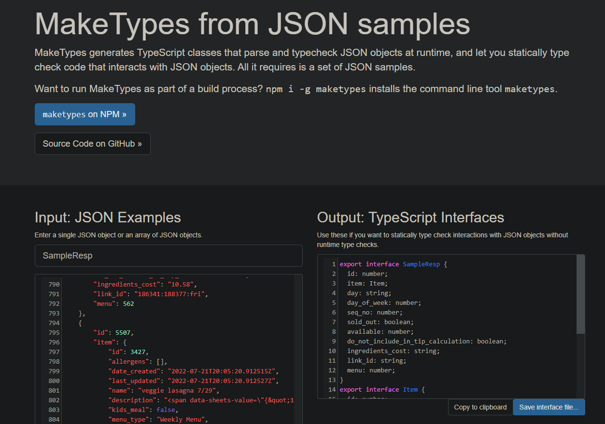

# MakeTypes

MakeTypes is a tool that takes in JSON and spits back out interfaces to help you reason about that data in your TypeScript code easier:

## Where these TS Interfaces came from

When I first sent a Postman GET request to https://app-staging.weco-dev.com/api/v1/sample/ , quite a bit of data with quite a bit of fields were returned.

Google brought me to an awesome tool I'd not seen before: [**MakeTypes**](http://jvilk.com/MakeTypes/)!
